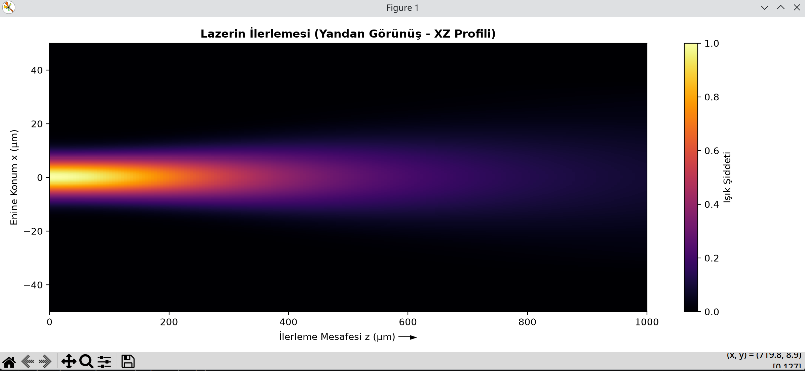
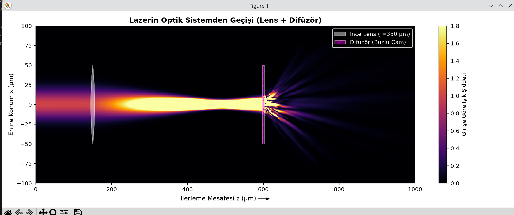
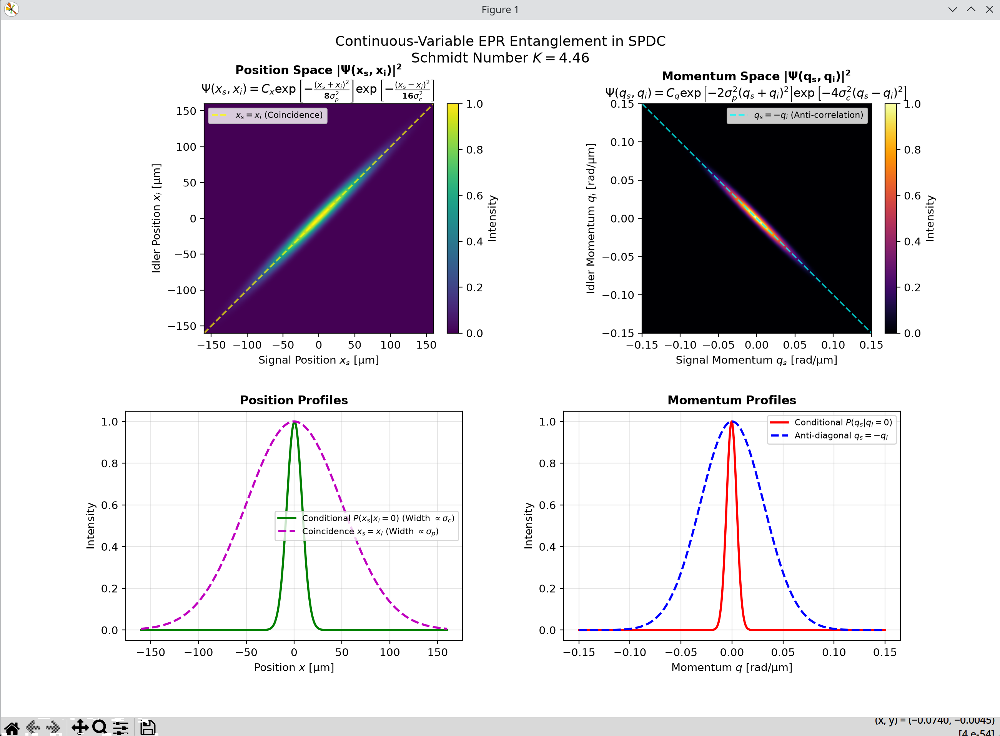
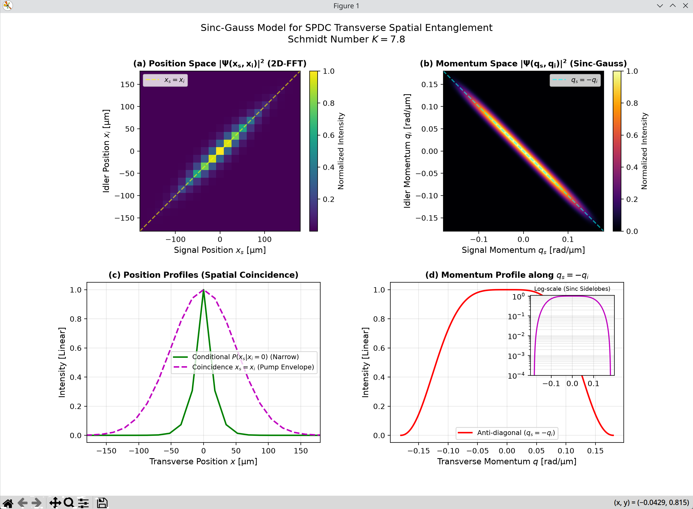
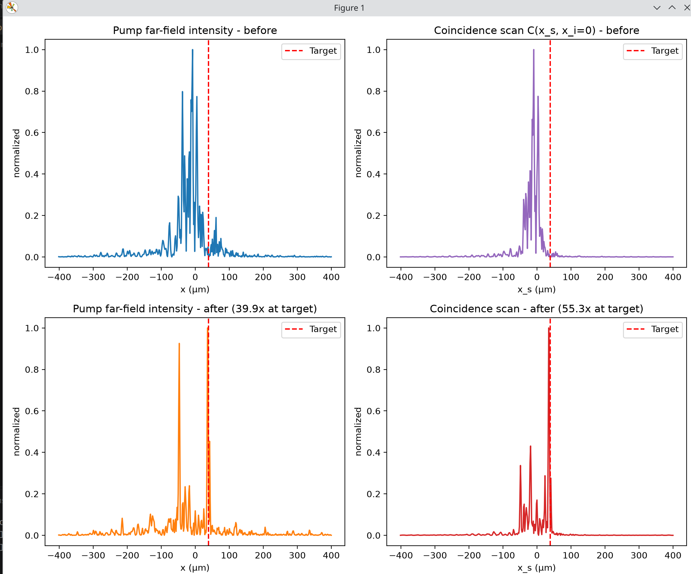
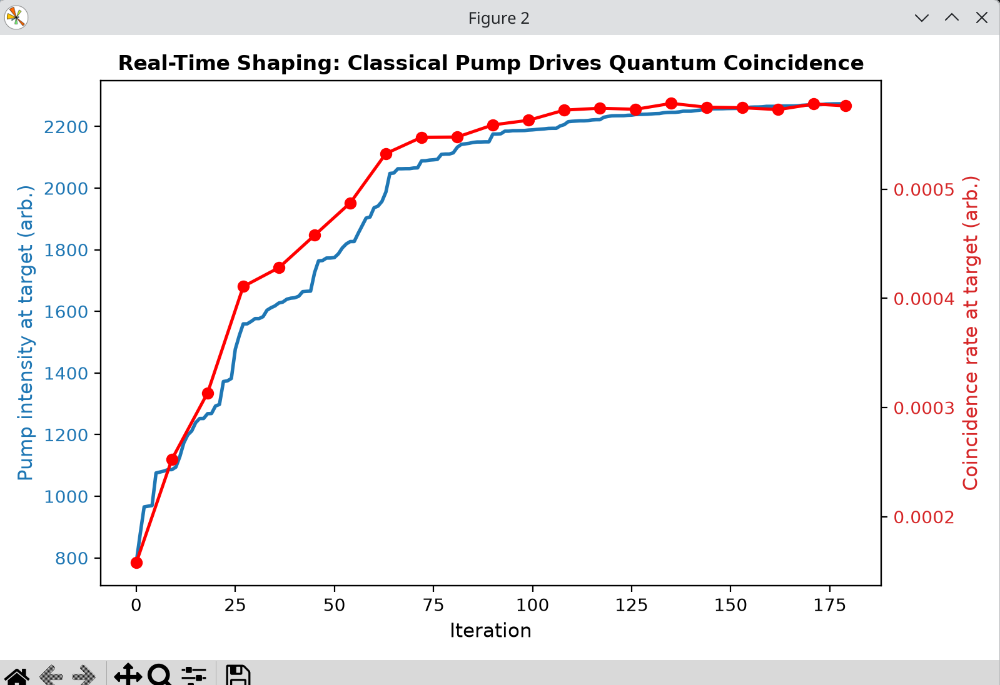

# Beam Propagation Method (BPM) Simülasyonları

Bu projede Açısal Spektrum Yöntemi (ASM) ve Split-Step BPM kullanılarak geliştirilen optik simülasyonlar ve çıktı grafikleri yer almaktadır.

---

### 1. Serbest Uzayda Lazer Yayılımı (`Bpm.py`)
Gauss lazer demetinin havada doğal kırınımı ve genişlemesi:

---

### 2. Lens ve Difüzör Modeli (`Bpm-lens-diffuser.py`)
Lazerin lense çarparak odaklanması ve ardından difüzörden geçerek saçılması:

---

### 3. SLM + Lens + Difüzör Düzeni (`Bpm-SLM.py`)
Lazerin SLM ile yukarı saptırılması (Beam Steering), lensle toplanması ve difüzörden saçılması:

---

### 4. SPDC Süreci - Çift Gauss Yaklaşımı ile EPR Dolanıklığı (`spdc-doublegaussian.py`)
Spontan Parametrik Aşağı Dönüşüm (SPDC) ile üretilen foton çiftlerinin sürekli değişkenli (Continuous-Variable) konum ve momentum kuantum dolanıklığının (EPR Hali) analitik modellenmesi:

* **Konum Uzayı ($x_s = x_i$):** Fotonların kristal içerisinde mikroskobik olarak aynı noktada eş-zamanlı doğumu (pozitif korelasyon).
* **Momentum Uzayı ($q_s = -q_i$):** Enine momentum korunumu gereği fotonların zıt yönlerde saçılması (ters korelasyon).
* **Dolanıklık Ölçütü:** Schmidt sayısı ($K \approx 4.46$) ve Heisenberg sınırını aşan $\Delta(x_s|x_i)\Delta(q_s|q_i) \ll 1/2$ koşullu varyansları ile EPR paradoksunun gösterimi.

---

### 5. SPDC Süreci - Sinc-Gauss Modeli ve Kırınım Analizi (`spdc-sincgaussian.py`)
Kristalin sonlu boyutu ($L$) ve fiziksel faz uyumunun $\text{sinc}$ profili ile modellenmesi; 2D Hızlı Fourier Dönüşümü (2D-IFFT) ile gerçek kırınım saçaklarının simülasyonu:

* **Momentum Uzayı:** $\text{sinc}(\Delta k_z L / 2)$ faz uyumu fonksiyonu kaynaklı salınımlı kırınım halkaları ve yan loblar (side-lobes).
* **Konum Uzayı (2D-FFT):** İdeal Gaussiyen yerine kırınım etkilerini ve gerçekçi uzaysal korelasyon kuyruklarını içeren konum profili.

---

### 6. Klasik Geri Besleme ile Dolaşık Fotonların Gerçek Zamanlı Dalga Cephesi Şekillendirmesi (`quantum-wavefront-shaping.py`)

Bu nihai aşamada, önceki tüm SPDC ve BPM modelleri birleştirilerek, saçıcı bir ortamdan (difüzör) geçen dolaşık foton çiftlerinin uzaysal korelasyonları, **kuantum sinyaline hiç dokunulmadan**, sadece klasik pompa lazerinin dalga cephesi şekillendirilerek (SLM) ve klasik şiddet geri beslemesiyle gerçek zamanlı olarak geri kazanılmıştır.

#### Fiziksel Mekanizma ve İlkeler:
* **Yüksek Schmidt Sayısı Rejimi ($K \approx 680$):** Kristal çıkışında foton çiftleri mikroskobik olarak aynı noktada doğar ($r_s \approx r_i$).
* **Speckle Özdeşliği ($\lambda_p = \lambda_s / 2$):** Dolaşık fotonlar ($\lambda_s = 808\text{ nm}$) difüzörden geçerken toplamda $2\phi_d$ fazı biriktirir. Pompa lazeri ($\lambda_p = 404\text{ nm}$) tam yarım dalgaboyuna sahip olduğundan difüzörden geçerken o da tam $2\phi_d$ fazı biriktirir. Sonuç olarak, uzak alanda klasik pompa speckle deseni ile iki-foton çakışma deseni ($C(x_s, x_i=0)$) birebir özdeşleşir ($r \approx 0.85$).
* **Hızlı Klasik Geri Besleme (Wavefront Shaping):** Zayıf ve gürültülü kuantum çakışma sinyali yerine, hedef koordinattaki parlak klasik pompa lazerinin şiddeti okunarak Partitioning Algoritması ile SLM fazları optimize edilmiştir.

---

#### Optimizasyon Öncesi ve Sonrası Karşılaştırması:
* **Optimizasyon Öncesi (Before):** Difüzör ortamı hem klasik pompayı hem de kuantum çakışma profilini rastgele bir speckle desenine dönüştürür. Belirlenen hedef dedektör koordinatında (kırmızı kesikli çizgi) şiddet sıfıra yakındır.
* **Optimizasyon Sonrası (After):** Sadece klasik pompa şiddeti kullanılarak SLM optimize edildiğinde, hedef noktada yapıcı girişimle keskin bir odak oluşur. Kuantum çakışma haritası, geri beslemede hiç ölçülmediği halde pompayı takip ederek hedefte kendini odaklar ve uzaysal dolanıklık başarıyla kurtarılır:
  * **Klasik Pompa Güçlenmesi:** Hedefte **$39.9\times$** artış.
  * **Kuantum Çakışma Güçlenmesi:** Hedefte **$55.3\times$** artış.

---

#### Gerçek Zamanlı Optimizasyon ve Eşzamanlı Yakınsama :
* **Mavi Eğri (Klasik Pompa Geri Beslemesi):** İterasyonlar boyunca klasik pompa şiddetinin hedefe kilitlenerek tırmanışı.
* **Kırmızı Eğri (Kuantum Çakışma Hızı):** Kuantum dedektörünün eşzamanlı olarak pompayı adım adım takip etmesi; klasik kontrolün kuantum korelasyonunu doğrudan sürdüğünün (driving) açık deneysel kanıtı.

