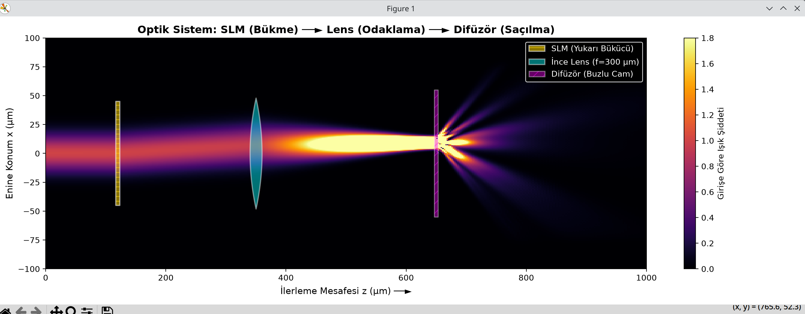

# Beam Propagation Method (BPM) Simülasyonları

Bu projede Açısal Spektrum Yöntemi (ASM) ve Split-Step BPM kullanılarak geliştirilen optik simülasyonlar ve çıktı grafikleri yer almaktadır.

---

### 1. Serbest Uzayda Lazer Yayılımı (`Bpm.py`)
Gauss lazer demetinin havada doğal kırınımı ve genişlemesi:

---

### 2. Lens ve Difüzör Modeli (`Bpm-lens-diffuser.py`)
Lazerin lense çarparak odaklanması ve ardından difüzörden geçerek saçılması:

---

### 3. SLM + Lens + Difüzör Düzeni (`Bpm-SLM.py`)
Lazerin SLM ile yukarı saptırılması (Beam Steering), lensle toplanması ve difüzörden saçılması:

